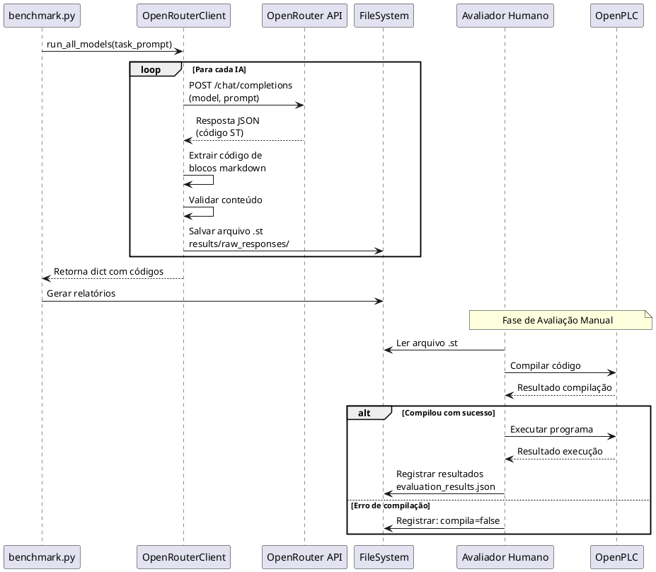
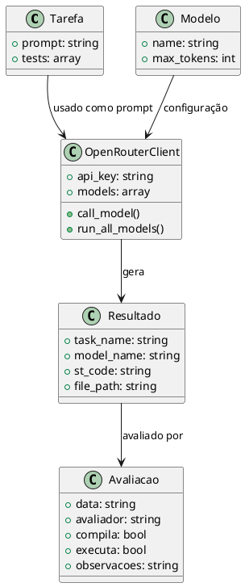

# Diagramas para TCC - Instruções de Criação

Este documento fornece descrições detalhadas e instruções para criar diagramas profissionais para o TCC usando ferramentas adequadas.

## Diagrama 1: Arquitetura do Sistema de Benchmark

### Descrição
Diagrama de blocos mostrando as 5 fases principais do sistema: Definição de Tarefas, Configuração de IAs, Execução do Benchmark, Organização de Resultados e Avaliação Manual.

### Elementos do Diagrama

**Fase 1: Definição das Tarefas**
- Retângulo com título "DEFINIÇÃO DAS TAREFAS"
- Lista: task_01.json (Lógica AND), task_02.json (Latch/Selo), task_03.json (Temporizador TON), task_04.json (Temporizador TOF), task_05.json (Contador CTU)
- Localização: Arquivos JSON em tasks/

**Fase 2: Configuração das IAs**
- Retângulo com título "CONFIGURAÇÃO DAS IAs"
- Lista dos 5 modelos: kwaipilot/kat-coder-pro:free, google/gemma-3n-e4b-it:free, nvidia/nemotron-nano-12b-v2-vl:free, openai/gpt-oss-20b:free, z-ai/glm-4.5-air:free
- Localização: config/models.yaml

**Fase 3: Execução do Benchmark**
- Retângulo principal "EXECUÇÃO DO BENCHMARK"
- Três subprocessos em sequência:
  1. Chamada OpenRouter API (envia prompt NL, recebe código ST)
  2. Processamento Resposta (extrai código de markdown, valida)
  3. Armazenamento Local (salva .st, organiza por tarefa/IA)
- Localização: benchmark.py

**Fase 4: Organização dos Resultados**
- Retângulo "ORGANIZAÇÃO DOS RESULTADOS"
- Estrutura de diretórios:
  - results/raw_responses/task_XX/[modelo].st
  - results/summary.json
  - results/README_AVALIACAO.md
  - results/evaluation_template.json

**Fase 5: Avaliação Manual**
- Retângulo "AVALIAÇÃO MANUAL (Agente Humano)"
- Três subprocessos:
  1. Compilação no OpenPLC (verifica erros sintáticos)
  2. Execução no OpenPLC (testa comportamento)
  3. Registro de Resultados (compila: true/false, executa: true/false, observações)

### Fluxo de Conexões
- Fase 1 → Fase 3 (seta)
- Fase 2 → Fase 3 (seta)
- Fase 3 → Fase 4 (seta)
- Fase 4 → Fase 5 (seta)

### Ferramentas Recomendadas
- **Draw.io (diagrams.net)**: Use blocos retangulares conectados por setas
- **LaTeX TikZ**: Código fornecido abaixo
- **Microsoft Visio**: Use template de fluxograma

### Código LaTeX TikZ (Diagrama 1)

```latex
\begin{figure}[h]
\centering
\begin{tikzpicture}[
    block/.style={rectangle, draw, fill=blue!20, text width=4cm, text centered, rounded corners, minimum height=1cm},
    subblock/.style={rectangle, draw, fill=green!20, text width=3cm, text centered, minimum height=0.8cm},
    arrow/.style={->, >=stealth, thick}
]

% Fase 1
\node[block] (fase1) at (0,8) {DEFINIÇÃO DAS TAREFAS \\ (Arquivos JSON)};
\node[subblock] (t1) at (-2,7) {task\_01.json};
\node[subblock] (t2) at (0,7) {task\_02.json};
\node[subblock] (t3) at (2,7) {task\_03.json};
\node[subblock] (t4) at (-1,6.5) {task\_04.json};
\node[subblock] (t5) at (1,6.5) {task\_05.json};

% Fase 2
\node[block] (fase2) at (0,5) {CONFIGURAÇÃO DAS IAs \\ (config/models.yaml)};
\node[subblock] (m1) at (-2,4) {kwaipilot};
\node[subblock] (m2) at (0,4) {google};
\node[subblock] (m3) at (2,4) {nvidia};
\node[subblock] (m4) at (-1,3.5) {openai};
\node[subblock] (m5) at (1,3.5) {z-ai};

% Fase 3
\node[block] (fase3) at (0,2) {EXECUÇÃO DO BENCHMARK \\ (benchmark.py)};
\node[subblock] (p1) at (-2,1) {Chamada API};
\node[subblock] (p2) at (0,1) {Processamento};
\node[subblock] (p3) at (2,1) {Armazenamento};

% Fase 4
\node[block] (fase4) at (0,-1) {ORGANIZAÇÃO DOS RESULTADOS \\ (results/)};

% Fase 5
\node[block] (fase5) at (0,-3.5) {AVALIAÇÃO MANUAL \\ (Agente Humano)};
\node[subblock] (a1) at (-2,-4.5) {Compilação};
\node[subblock] (a2) at (0,-4.5) {Execução};
\node[subblock] (a3) at (2,-4.5) {Registro};

% Conexões
\draw[arrow] (fase1) -- (fase3);
\draw[arrow] (fase2) -- (fase3);
\draw[arrow] (fase3) -- (fase4);
\draw[arrow] (fase4) -- (fase5);

\end{tikzpicture}
\caption{Arquitetura do Sistema de Benchmark}
\label{fig:arquitetura}
\end{figure}
```

---

## Diagrama 2: Fluxo de Dados Completo

### Descrição
Diagrama mostrando o fluxo de dados desde as entradas (tarefas, modelos, API key) até as saídas (resultados da avaliação).

### Elementos

**Entrada:**
- Tarefas (JSON) - tasks/task_*.json
- Modelos (YAML) - config/models.yaml
- API Key - .env

**Processamento:**
- benchmark.py (orquestrador)
- OpenRouterClient (módulo)
- OpenRouter API (serviço externo)

**Armazenamento:**
- Códigos ST Gerados - results/raw_responses/
- Relatórios - results/summary.json, README_AVALIACAO.md

**Avaliação:**
- Avaliador Humano
- OpenPLC (Compilador + Runtime)
- Resultados - evaluation_results.json

### Fluxo
1. Tarefas + Modelos → benchmark.py
2. benchmark.py → OpenRouterClient
3. OpenRouterClient → OpenRouter API
4. OpenRouter API → Código ST (retorno)
5. Código ST → Armazenamento
6. Armazenamento → Avaliador Humano
7. Avaliador → OpenPLC
8. OpenPLC → Resultados

### Código LaTeX TikZ (Diagrama 2)

```latex
\begin{figure}[h]
\centering
\begin{tikzpicture}[
    input/.style={rectangle, draw, fill=blue!30, text width=2.5cm, text centered, minimum height=1cm},
    process/.style={rectangle, draw, fill=green!30, text width=2.5cm, text centered, minimum height=1cm},
    storage/.style={rectangle, draw, fill=yellow!30, text width=2.5cm, text centered, minimum height=1cm},
    output/.style={rectangle, draw, fill=red!30, text width=2.5cm, text centered, minimum height=1cm},
    arrow/.style={->, >=stealth, thick}
]

% Entrada
\node[input] (tarefas) at (-4,4) {Tarefas \\ (JSON)};
\node[input] (modelos) at (-4,2) {Modelos \\ (YAML)};
\node[input] (apikey) at (-4,0) {API Key};

% Processamento
\node[process] (benchmark) at (0,3) {benchmark.py};
\node[process] (client) at (0,1) {OpenRouterClient};
\node[process] (api) at (4,2) {OpenRouter \\ API};

% Armazenamento
\node[storage] (codigos) at (0,-2) {Códigos ST \\ Gerados};

% Avaliação
\node[output] (avaliador) at (4,-2) {Avaliador \\ Humano};
\node[output] (openplc) at (4,-4) {OpenPLC};
\node[output] (resultados) at (0,-4) {Resultados \\ (JSON)};

% Conexões
\draw[arrow] (tarefas) -- (benchmark);
\draw[arrow] (modelos) -- (benchmark);
\draw[arrow] (apikey) -- (client);
\draw[arrow] (benchmark) -- (client);
\draw[arrow] (client) -- (api);
\draw[arrow] (api) to[bend left=30] node[midway,right] {NL→ST} (client);
\draw[arrow] (client) -- (codigos);
\draw[arrow] (codigos) -- (avaliador);
\draw[arrow] (avaliador) -- (openplc);
\draw[arrow] (openplc) -- (resultados);

\end{tikzpicture}
\caption{Fluxo de Dados do Sistema}
\label{fig:fluxo_dados}
\end{figure}
```

---

## Diagrama 3: Diagrama de Sequência - Geração de um Código

### Descrição
Diagrama de sequência mostrando a interação temporal entre os componentes durante a geração de um código ST.

### Participantes (de cima para baixo)
1. benchmark.py
2. OpenRouterClient
3. OpenRouter API
4. FileSystem
5. Avaliador Humano
6. OpenPLC

### Sequência de Mensagens

1. benchmark.py → OpenRouterClient: run_all_models(task_prompt)
2. Loop (Para cada IA):
   - OpenRouterClient → OpenRouter API: POST /chat/completions (model, prompt)
   - OpenRouter API → OpenRouterClient: Resposta JSON (código ST)
   - OpenRouterClient → OpenRouterClient: Extrair código de blocos markdown
   - OpenRouterClient → OpenRouterClient: Validar conteúdo
   - OpenRouterClient → FileSystem: Salvar arquivo .st
3. OpenRouterClient → benchmark.py: Retorna dict com códigos
4. benchmark.py → FileSystem: Gerar relatórios
5. (Fase de Avaliação Manual)
   - Avaliador Humano → FileSystem: Ler arquivo .st
   - Avaliador Humano → OpenPLC: Compilar código
   - OpenPLC → Avaliador Humano: Resultado compilação
   - [Se compilou] Avaliador Humano → OpenPLC: Executar programa
   - [Se compilou] OpenPLC → Avaliador Humano: Resultado execução
   - Avaliador Humano → FileSystem: Registrar resultados

### Ferramentas Recomendadas
- **PlantUML**: Ideal para diagramas de sequência
- **Draw.io**: Template de diagrama de sequência
- **LaTeX**: Pacote `pgf-umlsd`

### Código PlantUML (Diagrama 3)



---

## Diagrama 4: Estrutura de Dados

### Descrição
Diagrama de classes mostrando a estrutura de dados utilizada no sistema.

### Classes

**Tarefa**
- +prompt: string
- +tests: array

**Modelo**
- +name: string
- +max_tokens: int

**OpenRouterClient**
- +api_key: string
- +models: array
- +call_model()
- +run_all_models()

**Resultado**
- +task_name: string
- +model_name: string
- +st_code: string
- +file_path: string

**Avaliacao**
- +data: string
- +avaliador: string
- +compila: bool
- +executa: bool
- +observacoes: string

### Relações
- Tarefa → OpenRouterClient (usado como prompt)
- Modelo → OpenRouterClient (configuração)
- OpenRouterClient → Resultado (gera)
- Resultado → Avaliacao (avaliado por)

### Código PlantUML (Diagrama 4)



---

## Instruções para Criação dos Diagramas

### Opção 1: Draw.io (diagrams.net) - RECOMENDADO

1. Acesse https://app.diagrams.net/
2. Para Diagrama 1 e 2: Use template "Flowchart"
3. Para Diagrama 3: Use template "UML Sequence"
4. Para Diagrama 4: Use template "UML Class"
5. Exporte como PNG (alta resolução) ou PDF

### Opção 2: LaTeX (Overleaf)

1. Use os códigos TikZ fornecidos acima
2. Adicione no preâmbulo:
```latex
\usepackage{tikz}
\usetikzlibrary{shapes,arrows,positioning}
```
3. Compile e exporte como PDF

### Opção 3: PlantUML

1. Acesse https://www.plantuml.com/plantuml/uml/
2. Cole os códigos PlantUML fornecidos
3. Exporte como PNG ou SVG

### Opção 4: Microsoft Visio

1. Use templates de fluxograma e UML
2. Siga as descrições fornecidas acima
3. Exporte como PNG ou PDF

---

## Dicas para Diagramas Profissionais

1. **Cores consistentes**: Use a mesma paleta em todos os diagramas
2. **Tipografia**: Use fonte sans-serif (Arial, Helvetica)
3. **Tamanho**: Mínimo 300 DPI para impressão
4. **Legendas**: Sempre inclua legenda explicativa
5. **Numeração**: Numere os diagramas (Figura 1, Figura 2, etc.)
6. **Referências**: Referencie os diagramas no texto do TCC

