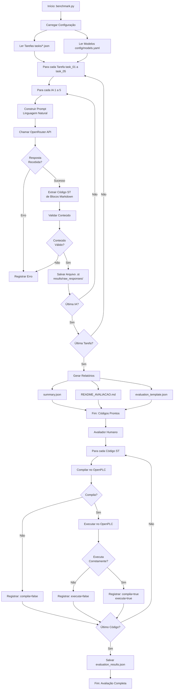
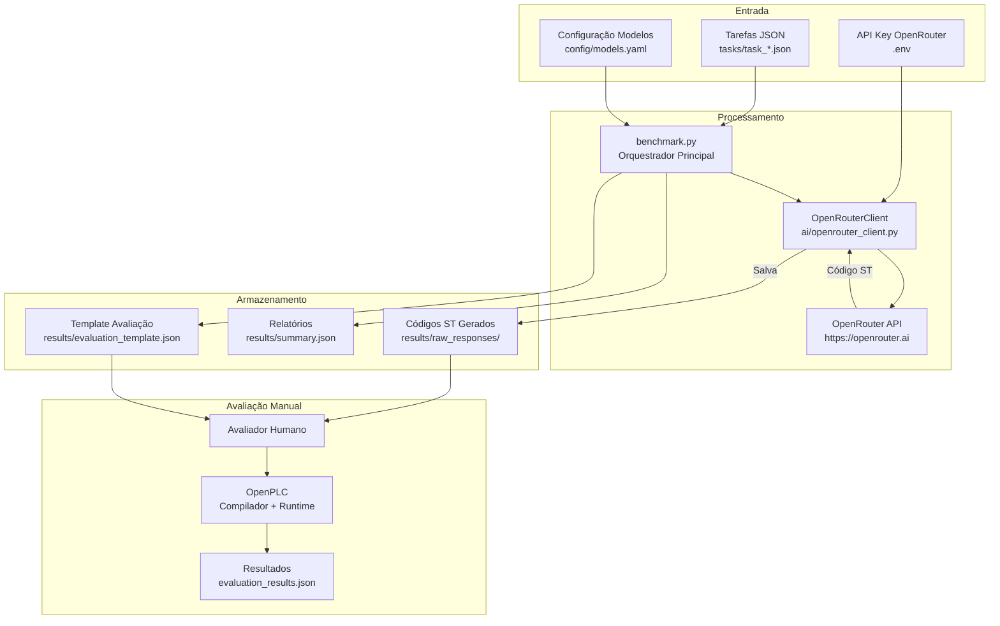
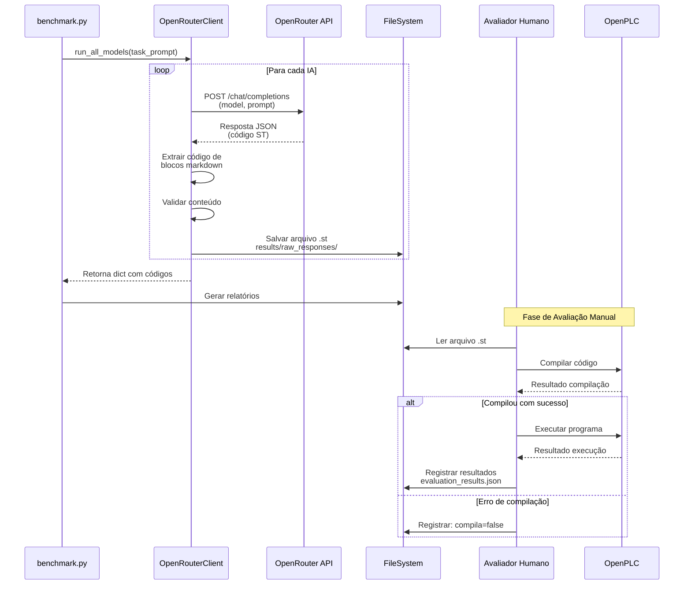
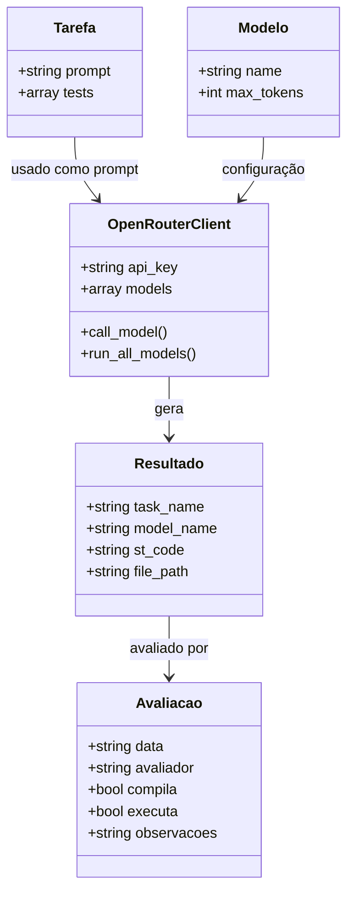
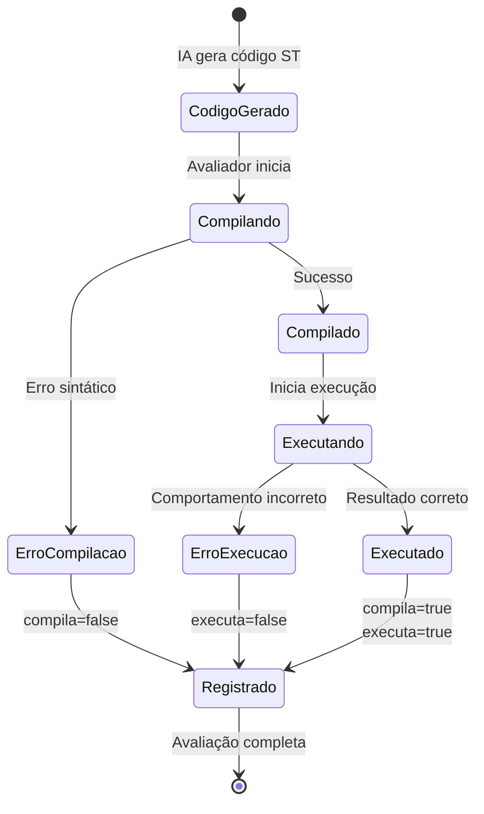
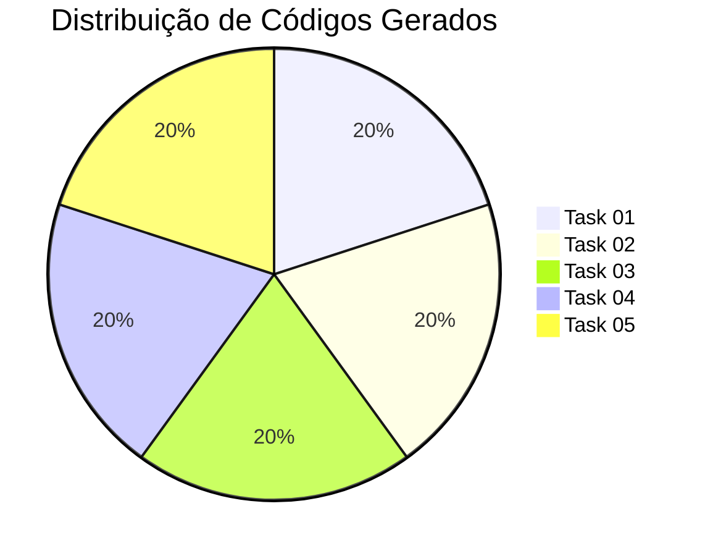
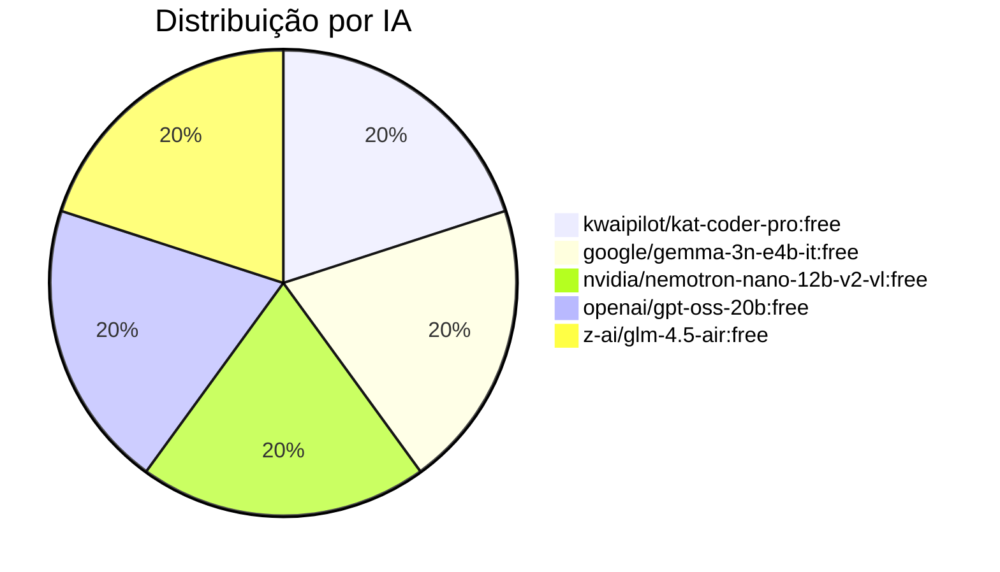

# Diagrama de Fluxo do Sistema - Formato Mermaid

Este arquivo contém diagramas em formato Mermaid que podem ser renderizados em ferramentas como:
- GitHub (renderização automática)
- VS Code (extensão Mermaid Preview)
- https://mermaid.live/
- Documentos LaTeX/Overleaf (com pacote mermaid)

## Diagrama de Fluxo Principal

## Diagrama de Arquitetura do Sistema

## Diagrama de Sequência: Geração de um Código

## Diagrama de Estrutura de Dados

## Diagrama de Estados: Processo de Avaliação

## Estatísticas do Benchmark

## Como Usar Estes Diagramas

1. **Para GitHub**: Os diagramas Mermaid são renderizados automaticamente em arquivos `.md`
2. **Para LaTeX/Overleaf**: Use o pacote `mermaid` ou converta para imagem
3. **Para Apresentações**: Use https://mermaid.live/ para exportar como PNG/SVG
4. **Para Word**: Converta via https://mermaid.live/ e insira como imagem

